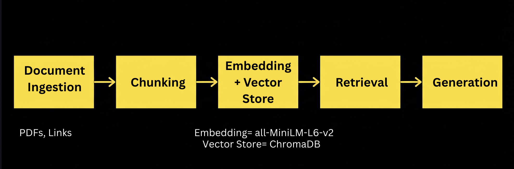
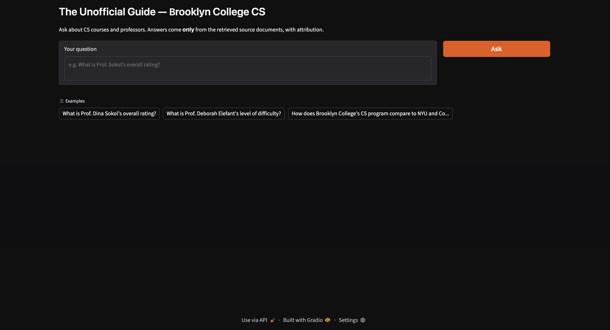
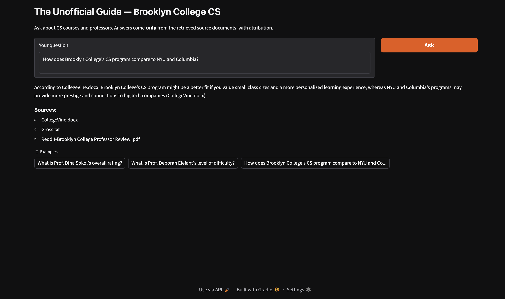

# The Unofficial Guide — Project 1

> **How to use this template:**
<!-- 
> Complete each section *after* you've built and tested the corresponding part of your system.
> Do not write placeholder text — if a section isn't done yet, leave it blank and come back.
> Every section below is required for submission. One-liners will not receive full credit.
-->
---

## Domain

<!-- What topic or category of knowledge does your system cover?
     Why is this knowledge valuable, and why is it hard to find through official channels?
     Example: "Student reviews of CS professors at [university] — useful because official
     course descriptions don't reflect teaching style, exam difficulty, or workload." -->
The topic this system covers is "Course and Professor Reviews". 
Student reviews of famous professors at Brooklyn College, because official sites don't give student reviews. 
The documents chosen mentions to avoid certain professors, reasons to choose Brooklyn College's Computer Science program and descriptions of certain courses. 
---

## Document Sources

<!-- List every source you collected documents from.
     Be specific: include URLs, subreddit names, forum thread titles, or file names.
     Aim for variety — sources that together cover different subtopics or perspectives. -->

| # | Source | Type | URL or file path |
|---|--------|------|------------------|
| 1 | RateMyProfessor | Review Site of Professors, review of Prof. Panneer Santhalingam |https://www.ratemyprofessors.com/professor/2995207 |
| 2 | RateMyProfessor | Review Site of Professors, review of Prof. Murray Gross |https://www.ratemyprofessors.com/professor/167158|
| 3 | RateMyProfessor | Review Site of Professors, review of Prof. Dina Sokol |https://www.ratemyprofessors.com/professor/334831 |
| 4 | RateMyProfessor| Review Site of Professors, review of Prof. Adele Piontnica | https://www.ratemyprofessors.com/professor/2722205 |
| 5 | RateMyProfessor | Review Site of Professors, review of Prof. Deborah Elefant | https://www.ratemyprofessors.com/professor/156077 |
| 6 | Reddit | Online Forum | https://www.reddit.com/r/CUNY/comments/1ci3hcu/brooklyn_college_professor_review_cisc/ |
| 7 | CollegeVine | | https://www.collegevine.com/faq/40319/thoughts-on-computer-science-program-at-brooklyn-college |
| 8 | Introduction to Programming Using C++ Syllabus | Pdf File | /Users/sangeetha/Downloads/CISC1110.pdf |
| 9 | Data Structures Syllabus | Pdf File | /Users/sangeetha/Downloads/CISC3130.pdf |
| 10 | Object-Oriented Programming Syllabus | Pdf File | /Users/sangeetha/Downloads/CISC_3150.pdf |

---

## Chunking Strategy

<!-- Describe your chunking approach with enough specificity that someone else could reproduce it.
     Include:
     - Chunk size (characters or tokens) and why that size fits your documents
     - Overlap size and why (or why not) you used overlap
     - Any preprocessing you did before chunking (e.g., stripping HTML, removing headers)
     - What your final chunk count was across all documents -->

**Chunk size:**
Chunk size =128
**Overlap:**
Overlap = 13
**Why these choices fit your documents:**
I wanted to keep the chunk size small to avoid noise. Overlap should be around 10% of chunk size. 
**Final chunk count:**
49
---

## Embedding Model

<!-- Name the embedding model you used and explain your choice.
     Then answer: if you were deploying this system for real users and cost wasn't a constraint,
     what tradeoffs would you weigh in choosing a different model?
     Consider: context length limits, multilingual support, accuracy on domain-specific text,
     latency, and local vs. API-hosted. -->

**Model used:**
sentence-transformers (all-MiniLM-L6-v2)

**Production tradeoff reflection:**

I chose all-MiniLM-L6-v2 because it is small, fast, and runs locally with no API cost, which fits a class project. If I were deploying this for real users and cost wasn't a constraint, I would weigh several tradeoffs. **Accuracy on domain-specific text** is my biggest concern: my evaluation showed this model underweights exact terms like course codes ("3150") and "big-O," so the gold chunks for those questions ranked #10 and #15 and were never retrieved. A stronger model such as bge-base-en or an API-hosted embedding (e.g. OpenAI text-embedding-3) would likely rank these short, keyword-heavy passages better. **Context length** matters less here since my chunks are only 128 tokens, well within all-MiniLM's 256-token window. The main tradeoffs against switching are **latency and cost** — a local 384-dim model returns results instantly with no network call or per-query fee, whereas an API-hosted model adds latency and ongoing cost. Given my accuracy issues are really a ranking problem, I would first try a hybrid keyword + vector retrieval approach before paying for a larger embedding model.
---

## Grounded Generation

<!-- Explain how your system enforces grounding — how does it prevent the LLM from answering
     beyond the retrieved documents?
     Describe both your system prompt (what instruction you gave the model) and any structural
     choices (e.g., how you formatted the context, whether you filtered low-relevance chunks).
     Do not just say "I told it to use the documents" — show the actual instruction or explain
     the mechanism. -->

**System prompt grounding instruction:**
System is "grounded" with prompt grounding which tells the model that it is only allowed to use the text provided. 

**How source attribution is surfaced in the response:**

Source attribution is applied by setting rules. The model is only allowed to use facts found in the context, and no
outside knowledge. If it doesnt know the answer, it may not guess or infer based on the text provided. It has to say
that it doesnt have enough information in my sources to answer the question. 

---

## Evaluation Report

<!-- Run your 5 test questions from planning.md through your system and record the results.
     Be honest — a partially accurate or inaccurate result that you explain well is more
     valuable than a suspiciously perfect result. -->

| # | Question | Expected answer | System response (summarized) | Retrieval quality | Response accuracy |
|---|----------|-----------------|------------------------------|-------------------|-------------------|
| 1 | How does Brooklyn College's CS program compare to NYU and Columbia? | If you value small class sizes and a more personalized learning experience, Brooklyn College's CS program might be a better fit compared to larger, more renowned programs at institutions like NYU or Columbia. However, if prestige and connections to big tech companies are more important to you, the programs at NYU/Columbia may provide more of what you're looking for. | According to CollegeVine.docx, Brooklyn College's CS program might be a better fit if you value small class sizes and a more personalized learning experience, whereas NYU and Columbia's programs may provide more prestige and connections to big tech companies (CollegeVine.docx). | High Quality | Accurate |
| 2 | Which Computer Science course teaches big-O notation? | Data Structures | I don't have enough information in my sources to answer that. | Low Quality | Inaccurate |
| 3 | What's Prof. Dina Sokol's overall rating? | 3.7 | Prof. Dina Sokol's overall rating is 3.7/5 (Sokol.txt). | High Quality | Accurate |
| 4 | What's Prof. Deborah Elefant's level of difficulty? | 3 | According to the context, Prof. Deborah Elefant's level of difficulty is rated as follows: 3.0 (Elefant.txt, two instances), 5.0 (Elefant.txt, one instance) | Partially relevant | Partially accurate |
| 5 | How many credits is CISC 3150? | 3 credits | I don't have enough information in my sources to answer that. | Off-target | Inaccurate |

**Retrieval quality:** Relevant / Partially relevant / Off-target  
**Response accuracy:** Accurate / Partially accurate / Inaccurate

---

## Failure Case Analysis

<!-- Identify at least one question where retrieval or generation did not work as expected.
     Write a specific explanation of *why* it failed, tied to a part of the pipeline.

     "The answer was wrong" is not an explanation.

     "The relevant information was split across a chunk boundary, so retrieval returned
     only half the context — the model didn't have enough to answer correctly" is an explanation.

     "The embedding model treated the professor's nickname as out-of-vocabulary and returned
     results from an unrelated review" is an explanation. -->

**Question that failed:**
"What's Prof. Dina Sokol's overall rating?"
**What the system returned:**
According to the context, Prof. Deborah Elefant's level of difficulty is rated as follows:
3.0 (Elefant.txt, two instances)
5.0 (Elefant.txt, one instance)
**Root cause (tied to a specific pipeline stage):**
It is reading other values near it and thinking its the difficulty rating. 
**What you would change to fix it:**
Further data cleaning may be required, if not switching to a hybrid retrieval method may fix it. 
---

## Spec Reflection

<!-- Reflect on how planning.md shaped your implementation.
     Answer both questions with at least 2–3 sentences each. -->

**One way the spec helped you during implementation:**
One way the spec helped me during implementation was identifying the questions beforehand. 
**One way your implementation diverged from the spec, and why:**
One way my implementation diverged from the spec is the top_k value. I started it as 3, but I had to change it to 5.
Top_k value of 10 does give better answers, but after clarifying with Claude, it was decided that we keep top_k as 5,
because a hybrid retrieval approach may fix current issues. 

---

## AI Usage

<!-- Describe at least 2 specific instances where you used an AI tool during this project.
     For each: what did you give the AI as input, what did it produce, and what did you
     change, override, or direct differently?

     "I used Claude to help me code" is not sufficient.
     "I gave Claude my Chunking Strategy section from planning.md and asked it to implement
     chunk_text(). It returned a function using a fixed character split. I overrode the
     chunk size from 500 to 200 because my documents are short reviews, not long guides." -->

**Instance 1**

- *What I gave the AI:* My Chunking Strategy section from planning.md (chunk size = 128, overlap = 13) and the documents/ folder, and asked Claude to implement an ingestion script that loads, cleans, and chunks the documents at those exact values.
- *What it produced:* A pipeline (src/ingest.py) that loads .txt/.pdf/.docx, cleans the text, and chunks by token count using the all-MiniLM-L6-v2 tokenizer. Its first version sized chunks by tokens but rebuilt the text by decoding token IDs, which lowercased everything and added spaces around punctuation (e.g. "3.7" became "3. 7", "CISC 3150" became "cisc 3150").
- *What I changed or overrode:* I had it switch to slicing the chunk out of the ORIGINAL cleaned text using token-to-character offsets, so chunks keep real casing and punctuation. This mattered because my eval answers are exact values like "3.7" and "3 credits" — the degraded form would have hurt both retrieval and the displayed sources. Final output: 49 chunks across 10 documents.

**Instance 2**

- *What I gave the AI:* My Retrieval Approach section (all-MiniLM-L6-v2, top-k = 3) and my 5 evaluation questions, and asked Claude to build the embedding + ChromaDB store + retrieval function and test it on those questions across different top-k values.
- *What it produced:* src/vector_store.py (embeds chunks, stores them in ChromaDB with source metadata, retrieve() function) plus src/evaluate.py, which showed that at both k=3 and k=5 only 3/5 questions retrieved the correct chunk — the gold chunks for the big-O and CISC 3150 questions ranked #15 and #10.
- *What I changed or overrode:* I raised top-k from 3 to 5 for recall headroom, but overrode the temptation to go to k=10. The evidence showed k=10 would only rescue one question while burying the right chunk under nine higher-scoring distractors, so I kept k=5 and concluded the real fix is retrieval-side (hybrid keyword + vector search), not a larger k.

## Images

<!-- 
Notes:
After cleaning, CISC1110.pdf is 828 tokens of text.

The chunk window advances by step = chunk_size − overlap = 128 − 13 = 115 tokens each time (the 13-token overlap means consecutive windows share tokens, so each one only moves forward 115). Window start positions:

0, 115, 230, 345, 460, 575, 690, 805   → 8 windows = 8 chunks
The first 7 are full 128-token chunks; the 8th starts at token 805 and runs to the end (828), so it's only 23 tokens — that's the min: 23 you saw in the stats.

Quick way to estimate it: ceil((828 − 13) / 115) = ceil(7.09) = 8.

So it's the largest document by text volume (a 2-page syllabus PDF), and at 128-token chunks with overlap it lands at 8 chunks. That's consistent — the other syllabi (3130, 3150) are shorter and the review .txt files are ~2 KB each, hence their 3–7 chunks.
--------------------------------------
All 5 eval facts land intact in a single chunk, including the longer narrative answer (Q1's full NYU/Columbia comparison fits in CollegeVine-2). Nothing is split across a boundary, so increasing overlap would buy you nothing but redundancy.
Token sizes are healthy (min 23 / max 129 / avg 117) and well under the model's 256-token window.
Your corpus is still dominated by short reviews + fact-lookup questions, where smaller chunks give better retrieval precision. Going to 256 would merge multiple unrelated reviews into one chunk and dilute the embedding — actively worse for "what's Sokol's rating."
The one mild risk with the new docs is that Reddit/CollegeVine are longer narrative discussions than the reviews. If, during Milestone 4 eval, Q1 retrieves only a fragment of the comparison reasoning, that's your signal to bump chunk size to ~192 for better narrative coherence. But right now the full answer already fits, so there's no reason to change preemptively.

Decision rule for later: only change if eval shows a concrete failure —

Retrieved chunk has half a multi-part answer → raise chunk size (192).
A fact is split across two chunks → raise overlap.
Neither is happening now.
Lock in 128/13, move to embedding + retrieval, and let real eval results drive any change. That's also a stronger story for your README's Spec Reflection than tuning blind.
-->
